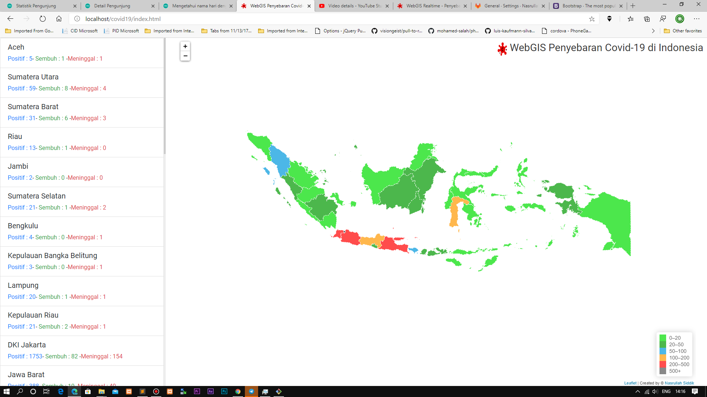

# WebGIS Penyebaran COVID-19 di Indonesia
WebGIS sederhana mengenai penyebaran Covid-19 di Indonesia, dengan tampilan Peta Tematik.

# Komponen dalam membangunnya
1. HTML+JS+CSS (JQuery)
2. Bootstrap untuk Template (https://getbootstrap.com/)
3. Leaflet untuk GIS-nya (https://leafletjs.com/)
4. API dari BNPB RI  (http://covid19.bnpb.go.id/)

# List Tutorial Youtube
## Tutorial WebGIS CodeIgniter
1. [Tutorial Webgis Codeigniter #PART 1 -  Konfigurasi dan Mengaplikasikan Template](https://youtu.be/YjVuFihl4dA)
2. [Tutorial Webgis Codeigniter #PART 2 - CRUD bagian Pertama (Create, Read, Update)](https://youtu.be/kZNehlstoMs)
3. [Tutorial Webgis Codeigniter #PART 3 - CRUD Bagian Kedua (Delete + Upload)](https://youtu.be/1bWxmzE95SQ)
4. [Tutorial Webgis Codeigniter #PART 4 - Menampilkan GeoJSON di Peta](https://youtu.be/zq7BhzANOAU)
5. [Tutorial Webgis Codeigniter #PART 5 - Mengambil titik koordinat dari Peta (CRUD Hotspot)](https://youtu.be/O3PfVjA991Y)
6. [Tutorial Webgis Codeigniter #PART 6 - Reverse Geocoding ESRI & Nominatim OSM](https://youtu.be/SVzq1lpOovc)
7. [Tutorial Webgis Codeigniter #PART 7 - CRUD Hotpost (Finishing & Update Helper Upload)](https://youtu.be/7ZhmJ5QUhPE)

## Tutorial WebGIS PHP
1. [Tutorial WEBGIS PHP #PART 1 - Membuat Template Project](https://www.youtube.com/watch?v=WooDHdZ4eOo)
2. [Tutorial WEBGIS PHP #PART 2 - Membuat Template Coding](https://youtu.be/ikxrjA0b-kg)
3. [Tutorial WEBGIS PHP #PART 3 - CRUD (Create Read Update Delete) di PHP bagian 1](https://youtu.be/EO5aUakI6Wo)
4. [Tutorial WEBGIS PHP #PART 4 - CRUD (Create Read Update Delete) di PHP bagian 2](https://youtu.be/4pDDhx-s1v4)
5. [Tutorial WEBGIS PHP #PART 5 - Form Login (Hak Akses Aplikasi)](https://youtu.be/OFKtjSPD0jA)
6. [Tutorial WEBGIS PHP #PART 6 - Upload FIle GeoJSON](https://youtu.be/aR9WTHl6gJ8)
7. [Tutorial WEBGIS PHP #PART 7 - Apply GeoJSON ke Leaflet](https://youtu.be/iTRq9jlDdkg)

## Seri Lanjutan Tutorial WebGIS PHP & LeafletJs
1. [Tutorial Leaflet - Menampilkan Marker (Point) dari Database](https://youtu.be/K3GJ4zeYnwo)
2. [Tutorial Leaflet - Kostumisasi Icon Marker (Point) sesuai Database](https://youtu.be/I6lFBH3J_Ts)
3. [Tutorial Leaflet - Clustering (Mengelompokan Titik Koordinat)](https://youtu.be/07HhzfDT7V4)
4. [Tutorial Leaflet  - Membuat GIS Sederhana Penyebaran Virus Corona](https://youtu.be/IAfcvPO8D1Y)
5. [Tutorial Leaflet - Membuat Heatmap (Peta Panas)](https://youtu.be/cCXv_G5QUyc)
6. [Tutorial Leaflet - Choroplet Map berdasarkan data di database](https://youtu.be/9jqKxq9vi-k)

## Tutorial PHP
1. [Tutorial PHP - Membuat GeoJSON Type Point](https://youtu.be/DSxW67uFK04)
2. [Tutorial PHP - Filter Data Menggunakan SQL](https://youtu.be/vuNHOhS-4a4)

## Tutorial Leaflet
1. [Tutorial Leaflet - Menampilkan Marker (Point) dari Database](https://youtu.be/K3GJ4zeYnwo)
2. [Tutorial Leaflet - Kostumisasi Icon Marker (Point) sesuai Database](https://youtu.be/I6lFBH3J_Ts)

# Donasi
Jika dirasa Tutorial dan Coding yang aku share bermanfaat, tidak salahnya bagi kalian jika ingin berdonasi. untuk donasi kalian bisa melalui : 
__BANK BRI__\
__No. Rekening 023901023305509__\
__An. Nasrullah Sidik__
atau 
https://trakteer.id/as.shiddiq

Berapapun Donasi Anda, Saya ucapkan Terima kasih banyak :)

Copyright © 2020 [Nasrullah Siddik](bit.ly/YTNSiddik). All rights reserved.

